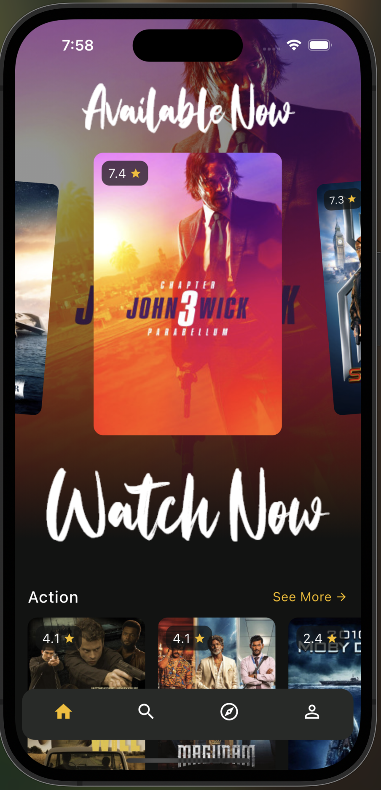
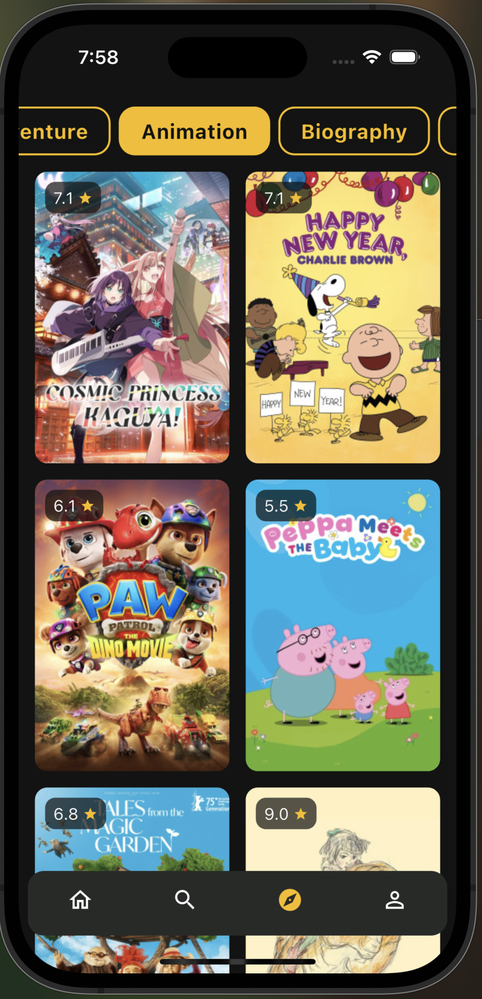
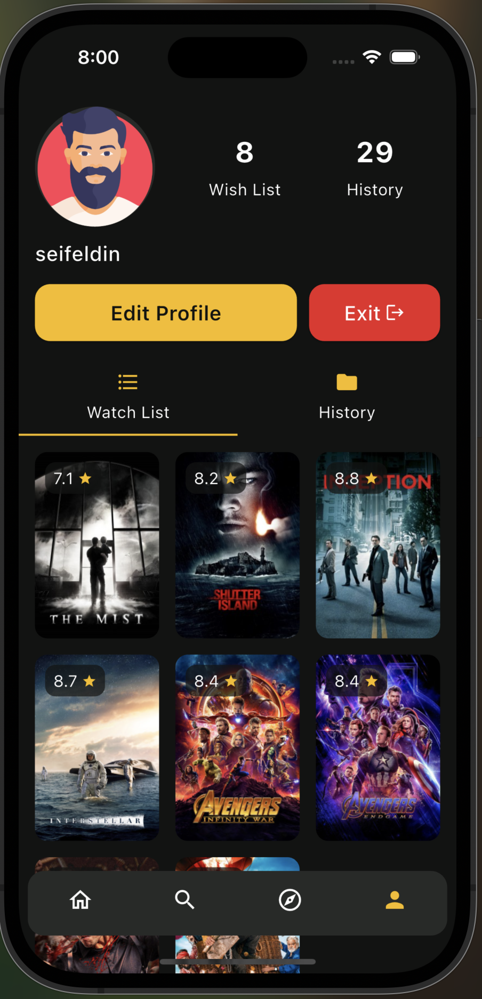
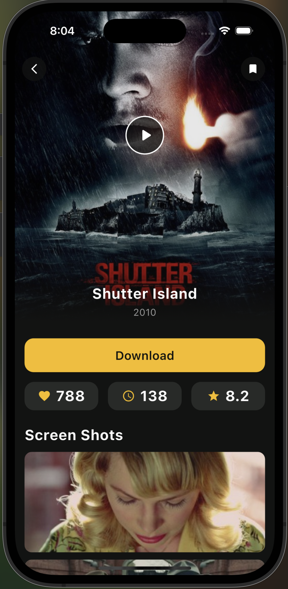
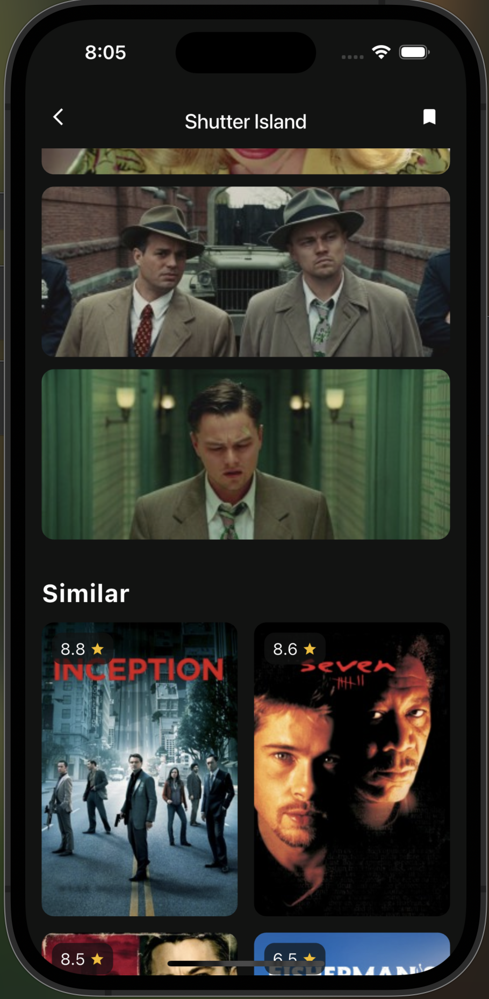
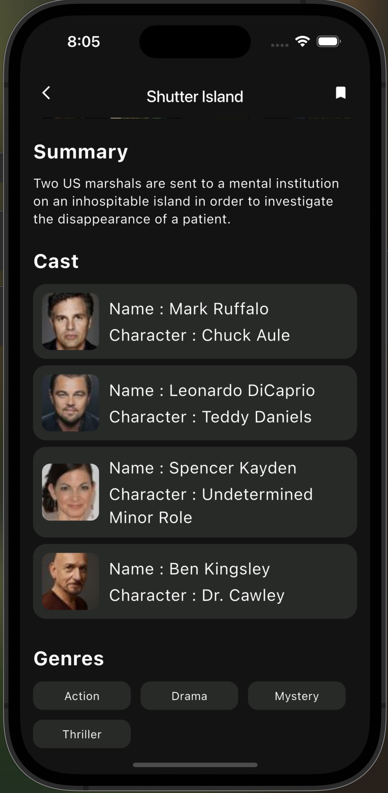
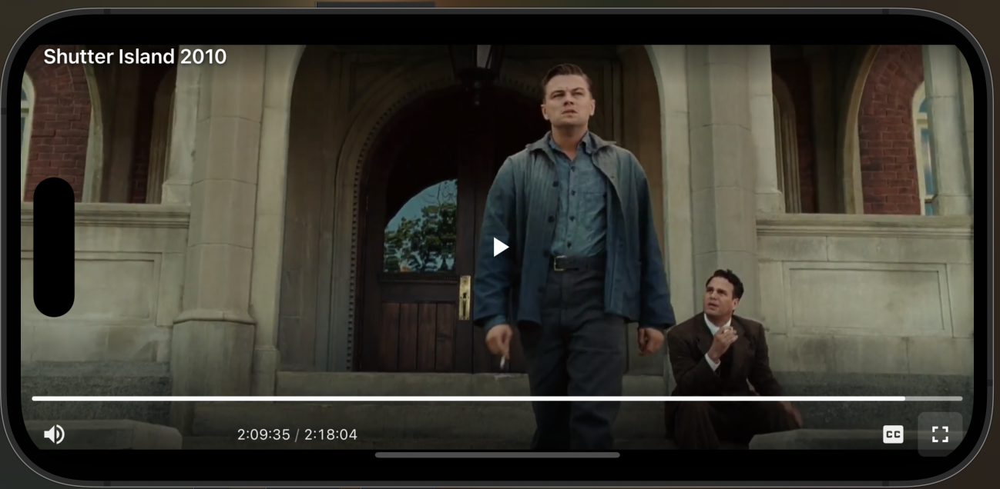
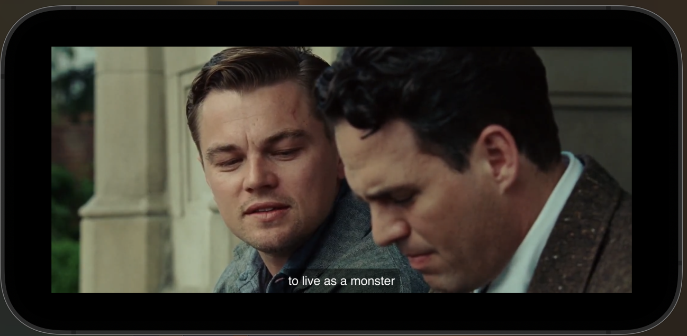
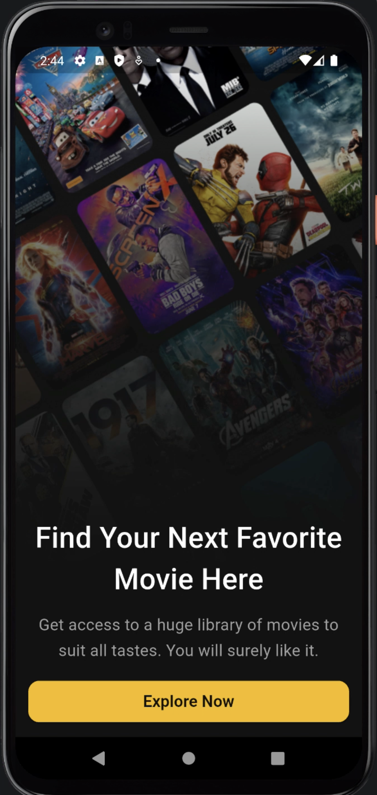
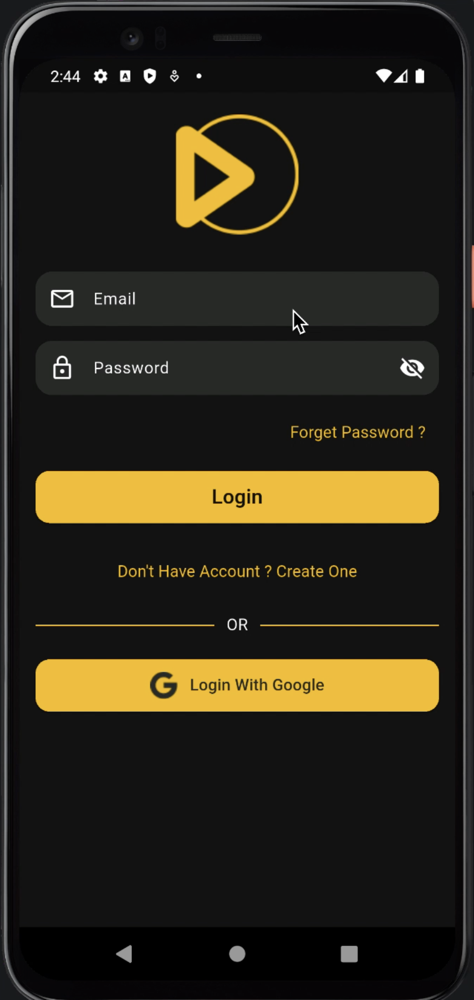

<div align="center">


# Movie App

**Browse, search and save movies — watch them inside the app, your watch list and history follow you across devices, and the catalogue still opens with no connection.**


</div>

---

## Features

- **Splash that waits for something real.** It hands over once its animation has finished *and* the first catalogue request has landed, so Home opens already drawn instead of showing a spinner.
- **Onboarding** — six pages introducing the app, shown once before sign-in.
- **Authentication** — email and password, Google Sign-In, registration, and password reset, all through Firebase. A restored session skips straight to the app.
- **Home** — a rating-filtered carousel of what people actually download, plus one row per genre. The backdrop tracks whichever poster is centred.
- **Search** — searches the catalogue as you type, debounced at 400 ms so a fast typist sends one request rather than one per letter.
- **Browse** — the full genre list as chips; each one is its own request, so the grid shows the real catalogue for that genre.
- **Movie details** — poster, likes, runtime, rating, stills, summary, cast with character names, similar titles, and genres.
- **Watch** — the play control on the artwork opens the movie in an in-app player. It rotates to landscape and hides the system bars so the video runs edge to edge, while the rest of the app stays portrait.
- **Profile** — display name, phone, and an avatar that is either a photo from the gallery or one of nine bundled illustrations. Edits write straight to Firebase.
- **Watch list** — save any movie from its details screen and find it again on your profile.
- **History** — opening a movie records it. The last 100 are kept for three days.
- **Works offline** — the last response the API actually returned is kept on disk and served when the network is gone, with a badge saying why.

> **Download button.** Movie details shows a Download button that opens a quality sheet. It is **UI only** — the qualities are fixed text and choosing one downloads nothing. The sheet says "Coming soon", and it is there so the screen is complete against the design. Watching happens through the player above.

## Screenshots

### iOS

<table>
<tr>
<td width="33%" align="center">
<br>
<b>Home</b><br>
Available Now carousel over a live backdrop.
</td>
<td width="33%" align="center">
<br>
<b>Browse</b><br>
Every genre as a chip, one request each.
</td>
<td width="33%" align="center">
<br>
<b>Profile</b><br>
Watch list and history, counted.
</td>
</tr>
<tr>
<td align="center">
<br>
<b>Movie details</b><br>
Play control, likes, runtime and rating.
</td>
<td align="center">
<br>
<b>Stills and similar</b><br>
Screenshots from the film, then what to watch next.
</td>
<td align="center">
<br>
<b>Cast and genres</b><br>
Every actor with the character they play.
</td>
</tr>
<tr>
<td align="center">
<br>
<b>Watch</b><br>
Rotates to landscape, system bars gone.
</td>
<td align="center">
<br>
<b>Full screen</b><br>
Edge to edge, still inside the app.
</td>
<td align="center">
</td>
</tr>
</table>

### Android

<table>
<tr>
<td width="33%" align="center">
<br>
<b>Onboarding</b><br>
Six pages, shown once.
</td>
<td width="33%" align="center">
<br>
<b>Login</b><br>
Email and password, or a Google account.
</td>
<td width="33%" align="center">
</td>
</tr>
</table>

## Tech stack

| Concern | Choice |
| --- | --- |
| Framework | Flutter 3.44 · Dart 3.12 |
| State management | `flutter_bloc` — ten Blocs, all full Event → State. No Cubits |
| Dependency injection | `get_it` — Blocs as factories, repositories and data sources as lazy singletons |
| Networking | `dio` — one client, 10 s timeouts, debug-only logging |
| Movie data | A YTS-compatible API, reached through a single base-URL constant |
| Auth and cloud data | `firebase_auth` · `cloud_firestore` · `google_sign_in` |
| Playback | `webview_flutter` — the provider's embed page, hosted in-app |
| On-device cache | `path_provider` — the last real API response, written as JSON |
| Responsive layout | `flutter_screenutil` — one 430 × 932 artboard, scaled per device |
| Value equality | `equatable` — so Bloc states compare by value and skip identical rebuilds |
| Splash animation | `animate_do` |

## Architecture

```
lib/
├── core/
│   ├── bloc/
│   │   └── request_status.dart
│   ├── constants/
│   │   ├── app_assets.dart
│   │   ├── app_config.dart
│   │   ├── app_genres.dart
│   │   ├── app_strings.dart
│   │   └── trailer_constants.dart
│   ├── di/
│   │   └── injector.dart
│   ├── movies/
│   │   ├── data/
│   │   │   ├── datasources/
│   │   │   │   ├── movie_local_datasource.dart
│   │   │   │   └── movie_remote_datasource.dart
│   │   │   ├── models/
│   │   │   │   ├── cast_member_model.dart
│   │   │   │   ├── json_read.dart
│   │   │   │   ├── movie_details_model.dart
│   │   │   │   └── movie_model.dart
│   │   │   └── repositories/
│   │   │       └── movie_repository_impl.dart
│   │   ├── domain/
│   │   │   ├── entities/
│   │   │   │   ├── cast_member.dart
│   │   │   │   ├── movie.dart
│   │   │   │   └── movie_details.dart
│   │   │   └── repositories/
│   │   │       └── movie_repository.dart
│   │   └── reference/
│   │       ├── list_movies_model.dart
│   │       └── sample_movies.dart
│   ├── network/
│   │   ├── api_client.dart
│   │   ├── api_endpoints.dart
│   │   ├── api_exception.dart
│   │   ├── network_status.dart
│   │   └── response_cache.dart
│   ├── routes/
│   │   ├── app_route_names.dart
│   │   └── app_router.dart
│   ├── theme/
│   │   ├── app_colors.dart
│   │   ├── app_text_styles.dart
│   │   └── app_theme.dart
│   ├── utils/
│   │   └── validators.dart
│   └── widgets/
│       ├── app_snack_bar.dart
│       ├── app_text_field.dart
│       ├── destructive_button.dart
│       ├── empty_view.dart
│       ├── error_view.dart
│       ├── genre_chip.dart
│       ├── loading_view.dart
│       ├── movie_grid.dart
│       ├── movie_poster_card.dart
│       ├── offline_indicator.dart
│       ├── popcorn_empty_art.dart
│       ├── popcorn_scene_painter.dart
│       ├── primary_button.dart
│       ├── rating_badge.dart
│       ├── secondary_button.dart
│       └── user_avatar.dart
├── features/
│   ├── auth/
│   │   ├── data/
│   │   │   ├── datasources/
│   │   │   │   └── firebase_auth_datasource.dart
│   │   │   └── repositories/
│   │   │       └── auth_repository_impl.dart
│   │   ├── domain/
│   │   │   ├── entities/
│   │   │   │   └── app_user.dart
│   │   │   └── repositories/
│   │   │       └── auth_repository.dart
│   │   └── presentation/
│   │       ├── bloc/
│   │       │   ├── forgot_password/
│   │       │   │   ├── forgot_password_bloc.dart
│   │       │   │   ├── forgot_password_event.dart
│   │       │   │   └── forgot_password_state.dart
│   │       │   ├── login/
│   │       │   │   ├── login_bloc.dart
│   │       │   │   ├── login_event.dart
│   │       │   │   └── login_state.dart
│   │       │   └── register/
│   │       │       ├── register_bloc.dart
│   │       │       ├── register_event.dart
│   │       │       └── register_state.dart
│   │       ├── screens/
│   │       │   ├── forgot_password_screen.dart
│   │       │   ├── login_screen.dart
│   │       │   └── register_screen.dart
│   │       └── widgets/
│   │           ├── avatar_picker.dart
│   │           ├── google_sign_in_button.dart
│   │           ├── or_divider.dart
│   │           └── password_text_field.dart
│   ├── history/
│   │   ├── data/
│   │   │   ├── datasources/
│   │   │   │   └── firestore_history_datasource.dart
│   │   │   └── repositories/
│   │   │       ├── firestore_history_repository.dart
│   │   │       └── in_memory_history_repository.dart
│   │   └── domain/
│   │       └── repositories/
│   │           └── history_repository.dart
│   ├── layout/
│   │   ├── browse/
│   │   │   └── presentation/
│   │   │       ├── bloc/
│   │   │       │   └── browse/
│   │   │       │       ├── browse_bloc.dart
│   │   │       │       ├── browse_event.dart
│   │   │       │       └── browse_state.dart
│   │   │       └── screens/
│   │   │           └── browse_tab.dart
│   │   ├── home/
│   │   │   ├── domain/
│   │   │   │   └── entities/
│   │   │   │       └── movie_section.dart
│   │   │   └── presentation/
│   │   │       ├── bloc/
│   │   │       │   └── home/
│   │   │       │       ├── home_bloc.dart
│   │   │       │       ├── home_event.dart
│   │   │       │       └── home_state.dart
│   │   │       ├── screens/
│   │   │       │   └── home_tab.dart
│   │   │       └── widgets/
│   │   │           ├── carousel_backdrop.dart
│   │   │           ├── genre_section.dart
│   │   │           └── movie_carousel.dart
│   │   ├── presentation/
│   │   │   ├── screens/
│   │   │   │   └── layout_screen.dart
│   │   │   └── widgets/
│   │   │       └── app_bottom_nav_bar.dart
│   │   ├── profile/
│   │   │   ├── data/
│   │   │   │   ├── datasources/
│   │   │   │   │   ├── avatar_photo_picker.dart
│   │   │   │   │   └── firestore_user_datasource.dart
│   │   │   │   └── repositories/
│   │   │   │       └── user_profile_repository_impl.dart
│   │   │   ├── domain/
│   │   │   │   ├── entities/
│   │   │   │   │   └── user_profile.dart
│   │   │   │   └── repositories/
│   │   │   │       └── user_profile_repository.dart
│   │   │   └── presentation/
│   │   │       ├── bloc/
│   │   │       │   ├── profile/
│   │   │       │   │   ├── profile_bloc.dart
│   │   │       │   │   ├── profile_event.dart
│   │   │       │   │   └── profile_state.dart
│   │   │       │   └── update_profile/
│   │   │       │       ├── update_profile_bloc.dart
│   │   │       │       ├── update_profile_event.dart
│   │   │       │       └── update_profile_state.dart
│   │   │       ├── screens/
│   │   │       │   ├── profile_tab.dart
│   │   │       │   └── update_profile_screen.dart
│   │   │       └── widgets/
│   │   │           ├── avatar_picker_sheet.dart
│   │   │           ├── avatar_source_sheet.dart
│   │   │           ├── profile_header.dart
│   │   │           └── profile_tab_bar.dart
│   │   └── search/
│   │       └── presentation/
│   │           ├── bloc/
│   │           │   └── search/
│   │           │       ├── search_bloc.dart
│   │           │       ├── search_event.dart
│   │           │       └── search_state.dart
│   │           └── screens/
│   │               └── search_tab.dart
│   ├── movie_details/
│   │   ├── presentation/
│   │   │   ├── bloc/
│   │   │   │   └── movie_details/
│   │   │   │       ├── movie_details_bloc.dart
│   │   │   │       ├── movie_details_event.dart
│   │   │   │       └── movie_details_state.dart
│   │   │   ├── screens/
│   │   │   │   └── movie_details_screen.dart
│   │   │   └── widgets/
│   │   │       ├── cast_row.dart
│   │   │       ├── details_hero.dart
│   │   │       ├── download_options_sheet.dart
│   │   │       ├── download_quality.dart
│   │   │       ├── genre_tag.dart
│   │   │       ├── movie_badge_row.dart
│   │   │       ├── screenshot_strip.dart
│   │   │       └── section_heading.dart
│   │   └── trailer/
│   │       ├── domain/
│   │       │   ├── movie_trailer_args.dart
│   │       │   └── movie_trailer_service.dart
│   │       └── presentation/
│   │           └── screens/
│   │               └── movie_trailer_screen.dart
│   ├── onboarding/
│   │   ├── data/
│   │   │   └── onboarding_slides.dart
│   │   ├── domain/
│   │   │   └── entities/
│   │   │       └── onboarding_slide_data.dart
│   │   └── presentation/
│   │       ├── screens/
│   │       │   └── onboarding_screen.dart
│   │       └── widgets/
│   │           ├── onboarding_intro_slide.dart
│   │           ├── onboarding_slide_view.dart
│   │           └── poster_backdrop.dart
│   ├── splash/
│   │   └── presentation/
│   │       ├── bloc/
│   │       │   └── splash/
│   │       │       ├── splash_bloc.dart
│   │       │       ├── splash_event.dart
│   │       │       └── splash_state.dart
│   │       └── screens/
│   │           └── splash_screen.dart
│   └── watchlist/
│       ├── data/
│       │   ├── datasources/
│       │   │   └── firestore_watchlist_datasource.dart
│       │   └── repositories/
│       │       └── watchlist_repository_impl.dart
│       └── domain/
│           └── repositories/
│               └── watchlist_repository.dart
├── app.dart
└── main.dart
```

- **Feature-first, with a layered inside.** Each feature owns `data/`, `domain/` and `presentation/` where it needs them. Dependencies point inward: a Bloc talks to a repository interface, never to Firestore or Dio.
- **The catalogue lives in `core/`, not in a feature.** `Movie` is used by seven features and `MovieRepository` by five, so distributing it would mean maintaining several copies of the same model. Keeping it in `core/` also means the shared poster widgets depend on `core`, rather than `core` reaching into a feature.
- **Repositories own the fallback, Blocs never see it.** A Bloc asks for movies and gets movies. Whether they came from memory, from disk, from the bundled snapshot, or not at all is decided below it.
- **No literals in widgets.** Every string, colour, dimension and asset path comes from `core/constants/` or `core/theme/`.
- **Errors arrive as sentences.** Data sources translate Firebase codes and Dio failures into text that can go straight on screen, so no Bloc ever handles an error code.

Offline behaviour is four layers, most specific first: an in-process memory cache, then the last real response on disk, then a bundled snapshot of three captured responses, and only then an error. A connection failure falls back; a 404 does not — showing yesterday's catalogue because the server said "not found" would be a lie.

## Packages

| Package | Purpose |
| --- | --- |
| `flutter_bloc` | State management — one Bloc per screen, Event in, State out |
| `equatable` | Value equality for states and events |
| `get_it` | Service locator wiring Blocs to repositories |
| `dio` | HTTP client for the movie API |
| `firebase_core` | Firebase initialisation |
| `firebase_auth` | Email/password auth, registration, password reset, session restore |
| `google_sign_in` | Google account sign-in, exchanged for a Firebase credential |
| `cloud_firestore` | Profile document, watch list and history |
| `webview_flutter` | Hosts the player's embed page in the app |
| `webview_flutter_android`, `webview_flutter_wkwebview` | Platform implementations, imported directly to enable inline media playback |
| `path_provider` | Locates the directory the response cache writes to |
| `image_picker` | Picking a profile photo from the gallery |
| `flutter_screenutil` | Scales the 430 × 932 design to the device |
| `animate_do` | Splash animation |
| `flutter_launcher_icons`, `flutter_native_splash` | Generate launcher icons and native splash screens |

## Firebase

Three services, and no others — there is no Storage, Messaging, Analytics or Crashlytics in this project.

- **Authentication** — email and password, registration with a display name, password reset, and Google Sign-In. The session is restored from disk on a cold start, so a signed-in user goes straight to the app.
- **Firestore — profile.** One document per user holding the display name, phone number and avatar.
- **Firestore — watch list and history.** The watch list is a subcollection keyed by movie id. History is a single capped document holding the last 100 entries, pruned on write and filtered to three days on read, so it cannot grow without bound.

**Profile photos are stored as base64 inside the user's Firestore document, not in Cloud Storage.** Uploads are downscaled to 300 px at 70% quality and capped at 700 KiB. Cloud Storage would have required the paid Blaze plan, which this project does not use.

## Try it

The app ships as an installable Android build — no toolchain, no Firebase project, nothing to configure.

**[⬇️ Download the APK](ADD_YOUR_GOOGLE_DRIVE_LINK_HERE)**

Android only. You will need to allow installation from unknown sources, since it is not distributed through Play.

> iOS cannot be installed this way — Apple requires builds to be signed for each device or distributed through TestFlight. The iOS screenshots above are from the app running on an iPhone simulator.

## Project status

Built as a Flutter graduation project. It talks to a live movie API, stores profiles, watch lists and history in Firebase, and covers its own behaviour with **143 tests across 21 files** — Blocs tested without a widget tree, screens tested against fake repositories rather than a network, and every async screen covered in its loading, error and empty states rather than only its success state.

Configuration is kept out of the repository: Firebase credentials, the Google OAuth client id and the playback provider are all git-ignored, with `.example` templates in their place.

## Future improvements

Ideas, not existing functionality:

- A real download layer behind the Download button.
- Pagination on Browse and Search — both currently load one page of twenty.
- Tablet and landscape layouts for the rest of the app; only the player rotates today.
- Arabic localisation and right-to-left support.
- Unit tests for the four Blocs that only have widget coverage today.
